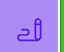

# My First Blog Post

This is the content of my very first blog post. It's written in Markdown.

- It's easy to write.
- It's clean.
- It will be converted to HTML by the Go backend.

Here is some `code` for you.

[to wiki](../wikis/first-wiki.md)

