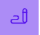

# test with different markdown syntax

## two

### three

#### four

##### five

###### six

This is a **bold** text.

this is an _italic_ text.

this is ~~strikethrough~~ text.

this is `inline code`.

this is bold and italic text **_combined_**.

Here is a [link](https://example.com) to an example website.

Here is an image:



Here is a code block:

```python
def hello_world():
    print("Hello, world!")

hello_world()

```

Here is a list:

- Item 1
- Item 2
- Item 3

> This is a blockquote.

Here is a horizontal rule:

---
